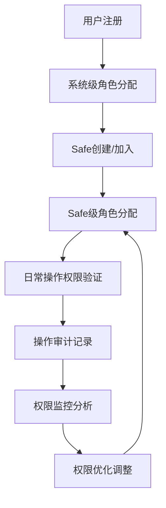

# 企业级Web3多签统一权限管理系统

## 📋 项目概述

本项目实现了基于三层权限架构的企业级Web3多签权限管理系统，提供统一、清晰、易用的权限管理界面，支持完整的权限生命周期管理。

## 🏗️ 系统架构

### 三层权限架构设计

```
┌─────────────────────────────────────────────────────────────┐
│                    系统级权限 (System Level)                    │
│  控制用户对整个平台的访问能力                                      │
│  ├── 用户管理: 用户注册审核、角色分配、状态管理                      │
│  ├── 系统配置: 全局策略、安全设置、健康监控                        │
│  └── 系统初始化: 超管初始化、基础数据配置                          │
└─────────────────────────────────────────────────────────────┘
                                │
                                ▼
┌─────────────────────────────────────────────────────────────┐
│                     Safe级权限 (Safe Level)                    │
│  控制用户在特定Safe内的角色和权限                                  │
│  ├── Safe选择器: Safe列表、信息展示、快速切换                      │
│  ├── 成员管理: 成员列表、角色分配、邀请移除                        │
│  ├── 角色配置: 角色定义、权限配置、继承关系                        │
│  └── 权限模板: 预定义模板、快速应用、自定义创建                     │
└─────────────────────────────────────────────────────────────┘
                                │
                                ▼
┌─────────────────────────────────────────────────────────────┐
│                   操作级权限 (Operation Level)                  │
│  控制具体业务操作的执行权限                                       │
│  ├── 权限定义: 权限列表、分类描述、依赖关系                        │
│  ├── 审计日志: 操作记录、验证日志、异常告警                        │
│  └── 权限监控: 使用统计、分布分析、实时状态                        │
└─────────────────────────────────────────────────────────────┘
```

## 🎯 核心功能特性

### ✅ 已实现功能

1. **统一权限管理界面**
   - 基于三层架构的清晰导航
   - 直观的权限级别选择器
   - 响应式设计，支持多设备访问

2. **系统级权限管理**
   - 用户列表查看和管理
   - 系统健康状态监控
   - 超级管理员初始化
   - 密码重置功能

3. **Safe级权限管理**
   - Safe钱包选择和切换
   - Safe信息展示
   - 成员管理界面框架
   - 角色配置模板

4. **操作级权限管理**
   - 权限定义管理
   - 审计日志查看
   - 权限使用统计

5. **路由和导航集成**
   - 统一权限管理页面路由
   - 兼容现有权限管理页面
   - 权限验证和访问控制

## 📁 文件结构

```
frontend/src/components/
├── UnifiedPermissionManagementSimple.tsx    # 统一权限管理主页面
├── permissions/
│   ├── SystemLevelPermissions.tsx           # 系统级权限管理
│   ├── SafeLevelPermissionsSimple.tsx       # Safe级权限管理
│   └── OperationLevelPermissions.tsx        # 操作级权限管理
└── ui/
    ├── Card.tsx                             # 卡片组件
    └── Button.tsx                           # 按钮组件

router/
└── index.tsx                                # 路由配置

docs/
├── unified-permission-management-guide.md   # 本文档
└── business-workflow-guide.md              # 业务流程指南
```

## 🚀 使用指南

### 访问权限管理系统

1. **登录系统**
   - 使用管理员账户登录
   - 确保具有admin角色权限

2. **访问统一权限管理**
   - 导航到 `/permissions` 路径
   - 系统会自动验证权限并显示管理界面

### 权限管理操作流程

#### 系统级权限管理

1. **用户管理**
   ```
   选择"系统级权限" → "用户管理"
   - 查看所有系统用户
   - 重置管理员密码
   - 分配用户权限
   ```

2. **系统配置**
   ```
   选择"系统级权限" → "系统配置"
   - 查看系统健康状态
   - 监控系统指标
   - 配置全局设置
   ```

3. **系统初始化**
   ```
   选择"系统级权限" → "系统初始化"
   - 初始化超级管理员
   - 配置基础数据
   - 系统首次设置
   ```

#### Safe级权限管理

1. **Safe选择**
   ```
   选择"Safe级权限" → "Safe选择器"
   - 浏览所有Safe钱包
   - 查看Safe详细信息
   - 快速切换管理目标
   ```

2. **成员管理**
   ```
   选择"Safe级权限" → "成员管理"
   - 查看Safe成员列表
   - 添加/移除成员
   - 分配成员角色
   ```

3. **角色配置**
   ```
   选择"Safe级权限" → "角色配置"
   - 定义Safe内角色
   - 配置角色权限
   - 设置权限继承
   ```

4. **权限模板**
   ```
   选择"Safe级权限" → "权限模板"
   - 使用预定义模板
   - 创建自定义模板
   - 批量应用权限
   ```

#### 操作级权限管理

1. **权限定义**
   ```
   选择"操作级权限" → "权限定义"
   - 查看所有权限列表
   - 搜索和过滤权限
   - 管理权限分类
   ```

2. **审计日志**
   ```
   选择"操作级权限" → "审计日志"
   - 查看操作记录
   - 筛选时间范围
   - 导出日志数据
   ```

3. **权限监控**
   ```
   选择"操作级权限" → "权限监控"
   - 查看权限使用统计
   - 分析权限分布
   - 监控系统状态
   ```

## 🔧 技术实现

### 前端技术栈

- **React 18**: 现代化的用户界面框架
- **TypeScript**: 类型安全的JavaScript超集
- **Tailwind CSS**: 实用优先的CSS框架
- **Lucide React**: 现代化的图标库
- **Zustand**: 轻量级状态管理

### 组件设计原则

1. **模块化设计**
   - 每个权限级别独立组件
   - 可复用的UI组件
   - 清晰的组件职责分离

2. **类型安全**
   - 完整的TypeScript类型定义
   - 接口和数据结构规范
   - 编译时错误检查

3. **用户体验**
   - 响应式设计
   - 直观的导航结构
   - 清晰的状态反馈

### API集成

```typescript
// 权限管理API调用示例
const fetchUsers = async () => {
  const response = await fetch('/api/v1/users', {
    headers: {
      'Authorization': `Bearer ${token}`,
      'Content-Type': 'application/json'
    }
  });
  return response.json();
};
```

## 📊 系统优势

### 1. 统一管理界面
- **问题解决**: 消除了原有的菜单分散和功能重复
- **用户体验**: 提供一致的操作体验和清晰的导航

### 2. 三层权限架构
- **系统性**: 完整覆盖权限管理的各个层面
- **灵活性**: 支持细粒度的权限控制
- **可扩展**: 易于添加新的权限类型和功能

### 3. 企业级特性
- **审计追踪**: 完整的操作日志记录
- **权限模板**: 快速的角色权限分配
- **监控告警**: 实时的权限使用监控

### 4. 开发友好
- **模块化**: 清晰的代码组织结构
- **类型安全**: 完整的TypeScript支持
- **可维护**: 良好的代码注释和文档

## 🔄 业务流程闭环



## 🚧 待完善功能

### 高优先级
1. **完整的成员管理功能**
   - 成员邀请流程
   - 成员权限编辑
   - 批量成员操作

2. **权限模板系统**
   - 模板创建和编辑
   - 模板应用逻辑
   - 模板版本管理

3. **操作级权限完整实现**
   - 权限定义CRUD
   - 审计日志详细视图
   - 权限监控仪表板

### 中优先级
1. **权限申请工作流**
   - 权限申请提交
   - 审批流程管理
   - 申请状态跟踪

2. **高级搜索和过滤**
   - 多条件搜索
   - 保存搜索条件
   - 快速过滤器

3. **数据导出功能**
   - 权限报告生成
   - 审计日志导出
   - 用户权限清单

## 📈 性能优化

### 已实现优化
1. **组件懒加载**: 按需加载权限管理组件
2. **状态管理**: 使用Zustand进行高效状态管理
3. **API缓存**: 合理的数据缓存策略

### 计划优化
1. **虚拟滚动**: 大量数据列表的性能优化
2. **分页加载**: 减少初始加载时间
3. **搜索防抖**: 优化搜索体验

## 🔒 安全考虑

### 权限验证
- 前端路由级别的权限检查
- API调用的token验证
- 角色基础的功能访问控制

### 数据保护
- 敏感信息的脱敏显示
- 操作日志的完整记录
- 权限变更的审计追踪

## 🛠️ 部署和维护

### 部署要求
- Node.js 16+
- 现代浏览器支持
- 后端API服务正常运行

### 维护建议
1. **定期权限审计**: 检查权限分配的合理性
2. **日志监控**: 关注异常操作和权限使用模式
3. **用户反馈**: 收集用户体验反馈，持续改进

## 📞 技术支持

如有技术问题或功能建议，请联系开发团队或在项目仓库中提交Issue。

---

**文档版本**: v1.0  
**最后更新**: 2024-09-17  
